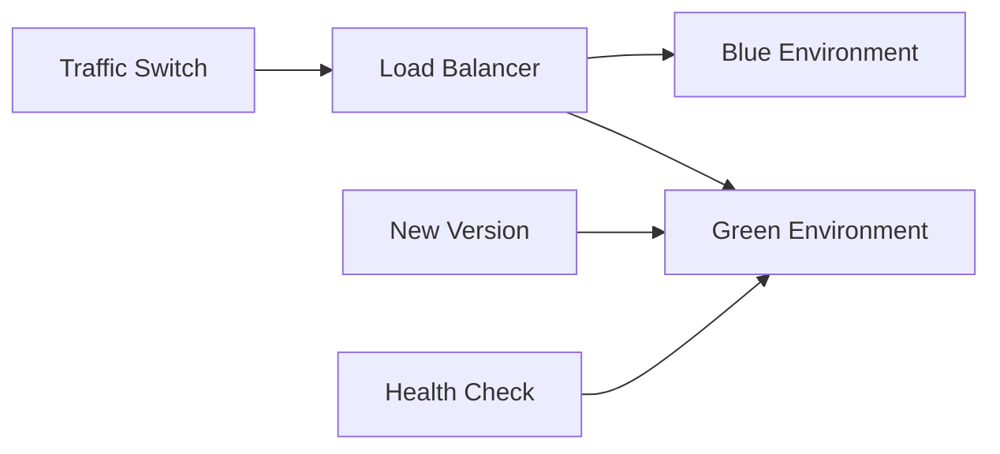

# Production Architecture Guide

## System Architecture Overview

```
┌─────────────────────────────────────────────────────────────────┐
│                           AWS Cloud                            │
├─────────────────────────────────────────────────────────────────┤
│  ┌─────────────────┐    ┌─────────────────┐                    │
│  │   CloudFront    │    │      Route53    │                    │
│  │      CDN        │    │       DNS       │                    │
│  └─────────┬───────┘    └─────────────────┘                    │
│            │                                                   │
│  ┌─────────▼───────────────────────────────────────────────┐   │
│  │                 Application Load Balancer               │   │
│  │                      (SSL Termination)                  │   │
│  └─────────┬───────────────┬───────────────────────────────┘   │
│            │               │                                   │
│  ┌─────────▼─────────┐   ┌─▼─────────────┐                    │
│  │   ECS Fargate     │   │   ECS Fargate │                    │
│  │   Frontend        │   │   Backend     │                    │
│  │   (Nginx + Vue)   │   │   (Flask)     │                    │
│  └───────────────────┘   └─┬─────────────┘                    │
│                            │                                   │
│            ┌───────────────┼───────────────┐                   │
│            │               │               │                   │
│  ┌─────────▼─────────┐   ┌─▼──────────┐  ┌─▼─────────────┐    │
│  │  RDS PostgreSQL   │   │ ElastiCache│  │  S3 Bucket    │    │
│  │   (Multi-AZ)      │   │   Redis    │  │  (File Store) │    │
│  └───────────────────┘   └────────────┘  └───────────────┘    │
└─────────────────────────────────────────────────────────────────┘

┌─────────────────────────────────────────────────────────────────┐
│                     Observability Stack                        │
├─────────────────────────────────────────────────────────────────┤
│  ┌─────────────────┐  ┌─────────────────┐  ┌─────────────────┐  │
│  │   CloudWatch    │  │  Application    │  │      SNS        │  │
│  │   Logs/Metrics  │  │   Insights      │  │   Alerting      │  │
│  └─────────────────┘  └─────────────────┘  └─────────────────┘  │
│                                                                 │
│  ┌─────────────────┐  ┌─────────────────┐  ┌─────────────────┐  │
│  │    Jaeger       │  │    Datadog      │  │   PagerDuty     │  │
│  │   Tracing       │  │   APM/Logs      │  │   Incident      │  │
│  └─────────────────┘  └─────────────────┘  └─────────────────┘  │
└─────────────────────────────────────────────────────────────────┘
```

## Component Details

### Frontend Layer
- **Technology**: Vue 3.5 + Vite 7 + Element Plus
- **Deployment**: ECS Fargate with Nginx reverse proxy
- **Scaling**: Auto-scaling based on CPU/memory metrics
- **CDN**: CloudFront for global content delivery
- **Security**: WAF rules, DDoS protection

### Backend Layer  
- **Technology**: Flask + SQLAlchemy + Gunicorn
- **Deployment**: ECS Fargate containers
- **Database**: PostgreSQL 16 on RDS with Multi-AZ
- **Caching**: Redis on ElastiCache for sessions/cache
- **Files**: S3 for file uploads and static assets

### Network Architecture
- **VPC**: 10.0.0.0/16 with public/private subnets
- **Security Groups**: Restrictive rules, principle of least privilege
- **Load Balancer**: Application Load Balancer with SSL termination
- **DNS**: Route53 for domain management

### Data Architecture
- **Primary DB**: PostgreSQL with automated backups
- **Read Replicas**: For read-heavy workloads
- **Cache Layer**: Redis for session storage and application cache
- **File Storage**: S3 with lifecycle policies

## Deployment Strategies

### Blue-Green Deployment


### Rolling Updates
- ECS service updates with health checks
- Gradual replacement of old containers
- Zero-downtime deployments
- Automatic rollback on failure

### Canary Deployments
- Route small percentage of traffic to new version
- Monitor metrics and error rates
- Gradual traffic increase if healthy
- Immediate rollback if issues detected

## Monitoring & Observability

### Application Performance Monitoring (APM)
```yaml
# DataDog APM Configuration
datadog:
  apiKey: ${DD_API_KEY}
  site: datadoghq.com
  logs:
    enabled: true
  metrics:
    enabled: true
  traces:
    enabled: true
  
# Service mapping
services:
  - name: evaluation-frontend
    env: production
    version: latest
  - name: evaluation-backend  
    env: production
    version: latest
```

### Key Metrics Dashboard
- **Business Metrics**: User registrations, evaluations created, approval rates
- **Application Metrics**: Response times, error rates, throughput
- **Infrastructure Metrics**: CPU, memory, disk usage, network I/O
- **Database Metrics**: Connection pool, query performance, deadlocks

### Alerting Strategy
```yaml
# Critical Alerts (PagerDuty)
- name: "Service Down"
  condition: "avg(last_5m):avg:aws.applicationelb.healthy_host_count < 1"
  priority: P1
  
- name: "High Error Rate"  
  condition: "avg(last_10m):avg:trace.flask.request.errors > 5"
  priority: P1

# Warning Alerts (Slack)
- name: "High Response Time"
  condition: "avg(last_15m):avg:trace.flask.request.duration > 2000"
  priority: P3
  
- name: "Database Connection High"
  condition: "avg(last_5m):avg:postgresql.connections > 80"
  priority: P2
```

## Security Architecture

### Network Security
- **WAF**: AWS WAF with OWASP Top 10 rules
- **DDoS**: AWS Shield Advanced protection
- **VPC**: Private subnets for databases and internal services
- **Security Groups**: Restrictive ingress/egress rules

### Application Security
- **Authentication**: JWT tokens with secure storage
- **Authorization**: Role-based access control (RBAC)
- **Data Encryption**: TLS 1.3 in transit, AES-256 at rest
- **Input Validation**: Comprehensive input sanitization
- **CORS**: Properly configured cross-origin policies

### Secrets Management
```hcl
# AWS Systems Manager Parameter Store
resource "aws_ssm_parameter" "database_url" {
  name  = "/evaluation-system/production/database-url"
  type  = "SecureString"
  value = "postgresql://..."
  
  tags = {
    Environment = "production"
    Application = "evaluation-system"
  }
}
```

## Disaster Recovery & Backup

### Backup Strategy
- **Database**: Automated daily backups with 30-day retention
- **Point-in-time Recovery**: 7-day window for PostgreSQL
- **Cross-region Replication**: S3 files replicated to DR region
- **Infrastructure as Code**: Terraform state backed up

### Recovery Procedures
```bash
# Database Recovery
aws rds restore-db-instance-from-db-snapshot \
  --db-instance-identifier evaluation-system-restored \
  --db-snapshot-identifier evaluation-system-snapshot-2024-01-01

# Application Recovery  
terraform apply -var-file=disaster-recovery.tfvars
aws ecs update-service --cluster dr-cluster --service evaluation-backend
```

### RTO/RPO Targets
- **Recovery Time Objective (RTO)**: 4 hours
- **Recovery Point Objective (RPO)**: 15 minutes
- **Business Continuity**: 99.9% uptime SLA

## Performance Optimization

### Database Optimization
```sql
-- Index optimization
CREATE INDEX CONCURRENTLY idx_evaluations_status_created 
ON evaluations(status, created_at);

CREATE INDEX CONCURRENTLY idx_users_role_active 
ON users(role, is_active);

-- Query optimization
EXPLAIN (ANALYZE, BUFFERS) 
SELECT * FROM evaluations 
WHERE status = 'pending' 
ORDER BY created_at DESC LIMIT 50;
```

### Caching Strategy
- **Application Cache**: Redis for frequently accessed data
- **CDN Cache**: CloudFront for static assets (24h TTL)
- **Database Cache**: Query result caching (5min TTL)
- **Session Cache**: Redis for user sessions

### Auto Scaling Configuration
```hcl
resource "aws_appautoscaling_policy" "backend_scale_up" {
  name               = "backend-scale-up"
  policy_type        = "TargetTrackingScaling"
  
  target_tracking_scaling_policy_configuration {
    predefined_metric_specification {
      predefined_metric_type = "ECSServiceAverageCPUUtilization"
    }
    target_value       = 70.0
    scale_out_cooldown = 300
    scale_in_cooldown  = 300
  }
}
```

This architecture provides enterprise-grade scalability, security, and reliability for the Product Evaluation Management System.